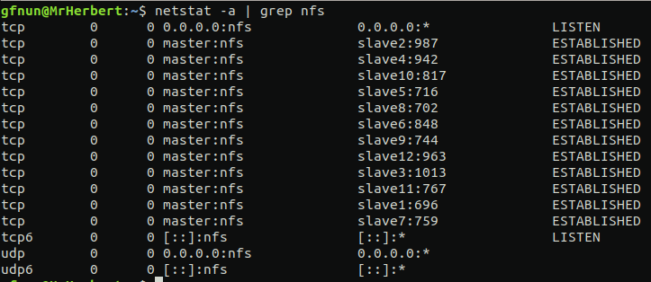

# Guía de uso Geant4 con Computación Distribuida

En esta carpeta se encuentra una guía paso a paso para ejecutar simulaciones de Geant4 haciendo uso de computación
distribuida con Geant4 mpi.

## Contenido del repositorio

**Aplicación Ejemplo**
- g4pntest_mpi

**Herramienta de apoyo**
- tools/cluster.py

**Guia rápida de usuario**
- 04_guia_usuario


## Estructura del cluster

Lo primero que se debe tener en cuanta es la estrucutura del cluster y su funcionamiento. El cluster está compuesto
por una red de computadores conectados entres si por una red local (LAN) a través de un modem. Después de estar todos
sobre la misma red el cluster tiene un servidor NFS (Sistema de archivos de red), este es el corazón del cluster ya que a través de 
este se comparten los archivos; para este caso la carpeta que se comparte es donde está instalado Geant4 y la aplicación que se va a usar en computación distribuida con Geant4-mpi. En el cluster solo en un computador se instala Geant4, a este se le llamara maestro, el resto de computadores a los que se les comparte estos archivos se les llamará esclavos.


Por último está open-mpi que es la librería que permite ejecutar multiples veces un programa en el cluster a través de mpi, lo cual es un especificación para programación de paso de mensajes, que báásicamente el programa usa para comunicar datos entre procesos.

## Montar cluster

### Verificar computadores disponibles con su respectiva IP en la red.

Para esto se hace uso de la herramienta cluster.py alojada en la carpeta tools. La aplicación se ejecuta en el maestor (MrHerbert).

```sh
$ python3 cluster.py
```

Luego de unos segundos la aplicación arrojara una salida como se aprecia en la siguiente imagen:


### Modificar el archivo hosts en el maestro MrHerbert

En el maestro entrar al archivo hosts, allí se encuentran las ips de cada computador en el cluster, si las ips han cambiado con respecto
a la salida generada por el programa anterior, modificarla según corresponda, el archivo debe verse algo así:

```sh
$ sudo vim /etc/hosts
```


### Comprobar acceso a cada esclavo a través de ssh

Se debe comprobar el acceso desde el maestro a cada esclavo. Así: 

```sh
$ ssh slave1
```
No debe pedir ninguna contraseña, debe ingresar directo. pero si las ips de los esclavos cambiaron (paso anterios) podría arrojar un error así:

```sh
@@@@@@@@@@@@@@@@@@@@@@@@@@@@@@@@@@@@@@@@@@@@@@@@@@@@@@@@@@@
@    WARNING: REMOTE HOST IDENTIFICATION HAS CHANGED!     @
@@@@@@@@@@@@@@@@@@@@@@@@@@@@@@@@@@@@@@@@@@@@@@@@@@@@@@@@@@@
IT IS POSSIBLE THAT SOMEONE IS DOING SOMETHING NASTY!
Someone could be eavesdropping on you right now (man-in-the-middle attack)!
It is also possible that a host key has just been changed.
The fingerprint for the RSA key sent by the remote host is
6e:45:f9:a8:af:38:3d:a1:a5:c7:76:1d:02:f8:77:00.
Please contact your system administrator.
Add correct host key in /home/hostname /.ssh/known_hosts to get rid of this message.
Offending RSA key in /var/lib/sss/pubconf/known_hosts:4
RSA host key for pong has changed and you have requested strict checking.
Host key verification failed.
```
Si esto pasa se debe ir al archivo known_hosts ubicado en /.ssh/ y eliminar la línea que indica el error anterior en este caso:

```sh
Offending RSA key in /var/lib/sss/pubconf/known_hosts:4
RSA host key for pong has changed and you have requested strict checking.
Host key verification failed.
```
Así entramos al archivo y eliminamos esta linea:

```sh
sudo vim ~/.ssh/known_hosts
```

### Modificar el archivo hosts en cada esclavo

Si la ip del maestro a cambiado recientemente, modificar el archivo hosts en cada esclavo, así cada esclavo debe verse como las siguientes imagenes:

Esclavo 1:


Esclavo 2:


### Compartir carpetas a través del servidor NFS

Esto se debe hacer cada vez que se quiera compartir una carpeta, es decir solo se hace una vez, si ya se estan compartiendo omitir los siguientes pasos. 

En el maestro, ver el estado del servidor:

```sh
$ sudo /etc/init.d/nfs-kernel-server status
```

Detener el servicio:

```sh
$ sudo /etc/init.d/nfs-kernel-server stop
```

Modificar el archivo exports

```sh
$ sudo pico /etc/exports
```
Añadir:

```sh
/home/gfnun/sharedFolder/ *(rw,sync,no_subtree_check)
/home/gfnun/Geant4-10.6/ *(rw,sync,no_subtree_check)
/home/gfnun/Geant4-10.5/ *(rw,sync,no_subtree_check)
```
Volver a la terminal, y hacer que todos los directorios colocados allí se exporten:

```sh
$ sudo exportfs -a
```

Verificar:

```sh
$ sudo exportfs
```
Salida en la terminal:

```sh
/home/gfnun/sharedFolder
		<world>
/home/gfnun/Geant4-10.6
		<world>
/home/gfnun/Geant4-10.5
		<world>
```

iniciar servicio:

```sh
$ sudo /etc/init.d/nfs-kernel-server start
```

### Montar las carpetas en cada esclavo

Verificar que todos los esclavos esten conectados al servidor:

```sh
netstat -a | grep nfs
```
la salida debe ser como se aprecia en la imagen, todos los esclavos deben estar conectados:



si alguno o todos no estan en la salida anterior, se debe hacer lo siguiente:


En los esclavos:

ejemplo si es el esclavo 1 el que no aparece:

```sh
$ ssh slave1
```

Montar las carpetas necesarias:

```sh
$ sudo mount master:/home/gfnun/sharedFolder sharedFolder/
$ sudo mount master:/home/gfnun/Geant4-10.6/ Geant4-10.6/
$ sudo mount master:/home/gfnun/Geant4-10.5/ Geant4-10.5/
```
Verificar que se esta compartiendo:

```sh
$ df -h
```

La salida debería ser:

```sh
master:/home/gfnun/sharedFolder               723G  440G  247G  65% /home/gfnun/sharedFolder
master:/home/gfnun/Geant4-10.6                723G  440G  247G  65% /home/gfnun/Geant4-10.6
master:/home/gfnun/Geant4-10.5                723G  440G  247G  65% /home/gfnun/Geant4-10.5
```


### Configuración Clúster

Para configurar el clúster y hacer uso de este con open mpi creamos un archio de texto plano llamado hostfile. Para este caso se tiene disponible 5 computadores con 8 hilos cada uno, es decir el clúster tiene 40 hilos disponibles. Si se desea usar todos los hilos disponibles el archivo debería erse así:

```sh
  master slots=8
  slave1 slots=8
  slave2 slots=8
  slave3 slots=8
  slave4 slots=8
```

Se puede administrar la cantidad de hilos a usar y en que computadores,por ejemplo:

```sh
  master slots=2
  slave1 slots=2
  slave2 slots=2
  slave3 slots=2
  slave4 slots=2
```
En este caso configuramos el clúster para usar 2 hilos por cada computador lo que da un total de 10 hilos a usar por el clúster.


### Comando Ejecución con Open mpi

A continuación el paso a paso para la ejecución de la aplicación:

Cargar variables de entorno:

```sh
$ source ~/Geant4-10.6/install/bin/geant4.sh
$ export PATH=/home/gfnun/sharedFolder/openmpi-install/bin:$PATH
$ export LD_LIBRARY_PATH=/home/gfnun/sharedFolder/openmpi-install/lib:$LD_LIBRARY_PATH 
```
Compilar, para este caso por ejemplo el nombre de la carpeta donde se encuentra el proyecto es g4pntest_mpi:

```sh
$ cd g4pntest_mpi
$ mkdir build
$ cd build
$ cmake -DG4mpi_DIR=/home/gfnun/Geant4-10.6/geant4-mpi/lib/G4mpi-10.6.1 -DCMAKE_CXX_COMPILER=/home/gfnun/sharedFolder/openmpi-install/bin/mpicxx \
      –DGeant4_DIR=/home/gfnun/Geant4-10.6/install/lib/Geant4-10.6.1 ../
$ make -j`nproc`  
```
Ejecución aplicación:

```sh
mpirun -np 40 -hostfile ../hostfile -x G4ABLADATA -x G4ENSDFSTATEDATA -x G4INCLDATA -x G4LEDATA -x G4LEVELGAMMADATA -x G4NEUTRONHPDATA -x G4PARTICLEXSDATA -x G4PIIDATA -x G4REALSURFACEDATA -x G4SAIDXSDATA -x G4RADIOACTIVEDATA -oversubscribe ./PNtest /macros/THEmacro.mac
```


